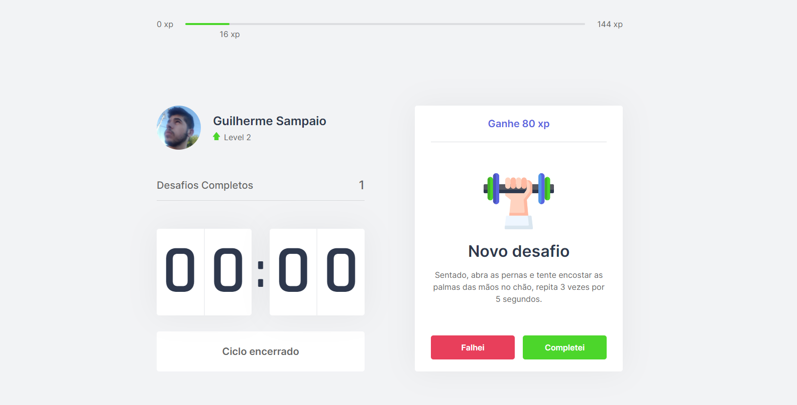

# Move-it
> An app for people that stay a long time in the computer, based in pomodoro's tecnic, wich start a 25 minutes timer and in the end of the time give a physical challenge or for vision, encouraging the stretching  and preventing health problems.


## Table of contents

* [Project status](#project-status)
* [Features](#features)
* [Demonstration](#demonstration)
* [How to run](#how-to-run)
* [Used technologies](#used-technologies)
* [Author](#author)
* [License](#license)

---
## Project Status

Status: **Development in progress.**

---
## Features

- [x] Build the default project
- [ ] Make the app more responsive
- [ ] Make a login page
- [ ] Make a side-bar
- [ ] Make a leaderboard
- [ ] Make a way to progress sharing
- [ ] Transform the page in PWA

---
## Demonstration


<a href='https://move-it-samp.vercel.app' target='_blank' >Link of project in the Vercel</a>

---
## How to run

If you want to run locally, you will need the following steps:

1. Clone repository
```bash
git clone https://github.com/Guilherme-Sampaio/Move-it.git

cd move-it
```
2. Have <a href='https://nodejs.org/en/' target='_blank' >nodejs</a> in your pc
2.1 - Run npm install to download dependencies
```bash
npm install
```
---
## Used technologies

* ReactJS
* NextJS
* Typescript
* Js-cookie
* Vercel

---
## Author

<a href="https://www.linkedin.com/in/guilherme-sampaio-4946a01a6/?miniProfileUrn=urn%3Ali%3Afs_miniProfile%3AACoAADAn1LABvmw2dWfN4Q51WAqXrKE4nrouSeU" target='_blank'>

</a>
</br>
<a href="https://www.linkedin.com/in/guilherme-sampaio-4946a01a6/?miniProfileUrn=urn%3Ali%3Afs_miniProfile%3AACoAADAn1LABvmw2dWfN4Q51WAqXrKE4nrouSeU" target='_blank'>
Guilherme Sampaio
</a>

[](https://www.linkedin.com/in/guilherme-sampaio-4946a01a6/?miniProfileUrn=urn%3Ali%3Afs_miniProfile%3AACoAADAn1LABvmw2dWfN4Q51WAqXrKE4nrouSeU) 
[](mailto:kaisergui258@gmail.com)

---
## License

[](https://github.com/Pietrogon/todo-list/blob/main/LICENSE)

```
MIT License

Copyright (c) 2021 Guilherme Luiz Sampaio

Permission is hereby granted, free of charge, to any person obtaining a copy
of this software and associated documentation files (the "Software"), to deal
in the Software without restriction, including without limitation the rights
to use, copy, modify, merge, publish, distribute, sublicense, and/or sell
copies of the Software, and to permit persons to whom the Software is
furnished to do so, subject to the following conditions:

The above copyright notice and this permission notice shall be included in all
copies or substantial portions of the Software.

THE SOFTWARE IS PROVIDED "AS IS", WITHOUT WARRANTY OF ANY KIND, EXPRESS OR
IMPLIED, INCLUDING BUT NOT LIMITED TO THE WARRANTIES OF MERCHANTABILITY,
FITNESS FOR A PARTICULAR PURPOSE AND NONINFRINGEMENT. IN NO EVENT SHALL THE
AUTHORS OR COPYRIGHT HOLDERS BE LIABLE FOR ANY CLAIM, DAMAGES OR OTHER
LIABILITY, WHETHER IN AN ACTION OF CONTRACT, TORT OR OTHERWISE, ARISING FROM,
OUT OF OR IN CONNECTION WITH THE SOFTWARE OR THE USE OR OTHER DEALINGS IN THE
SOFTWARE.
```